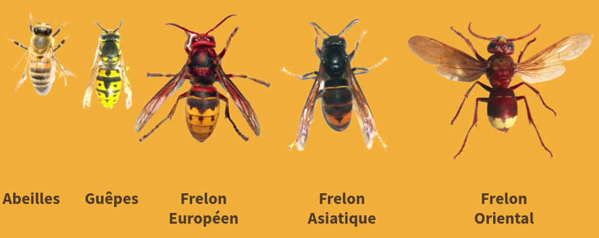
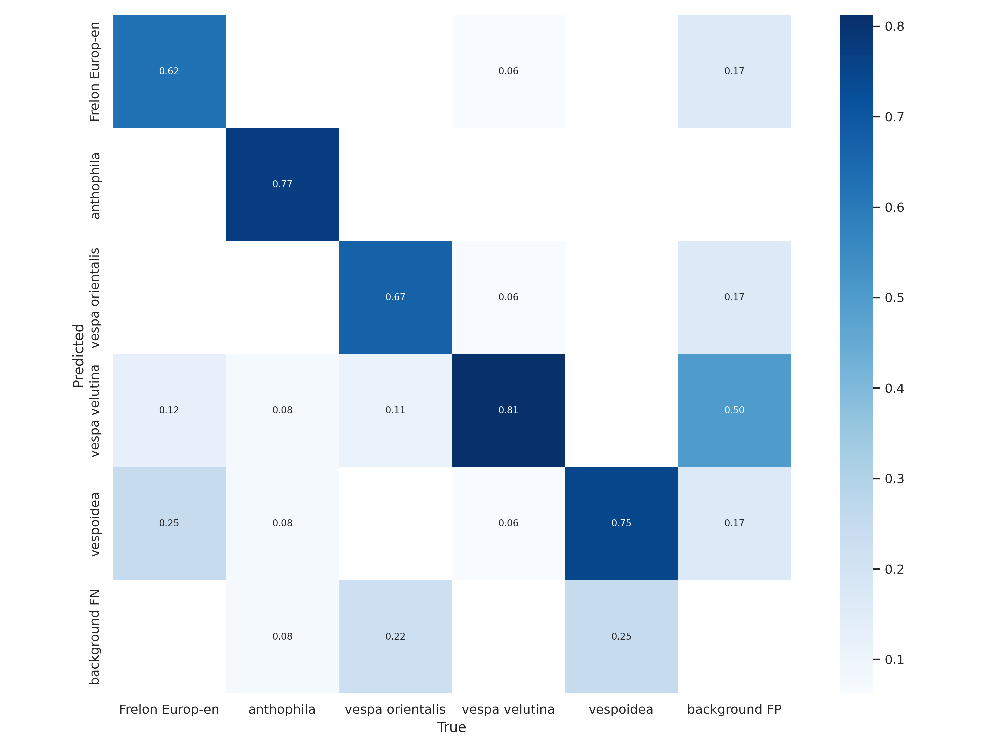
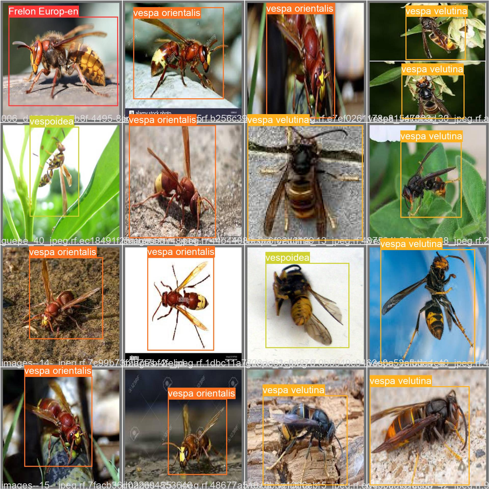
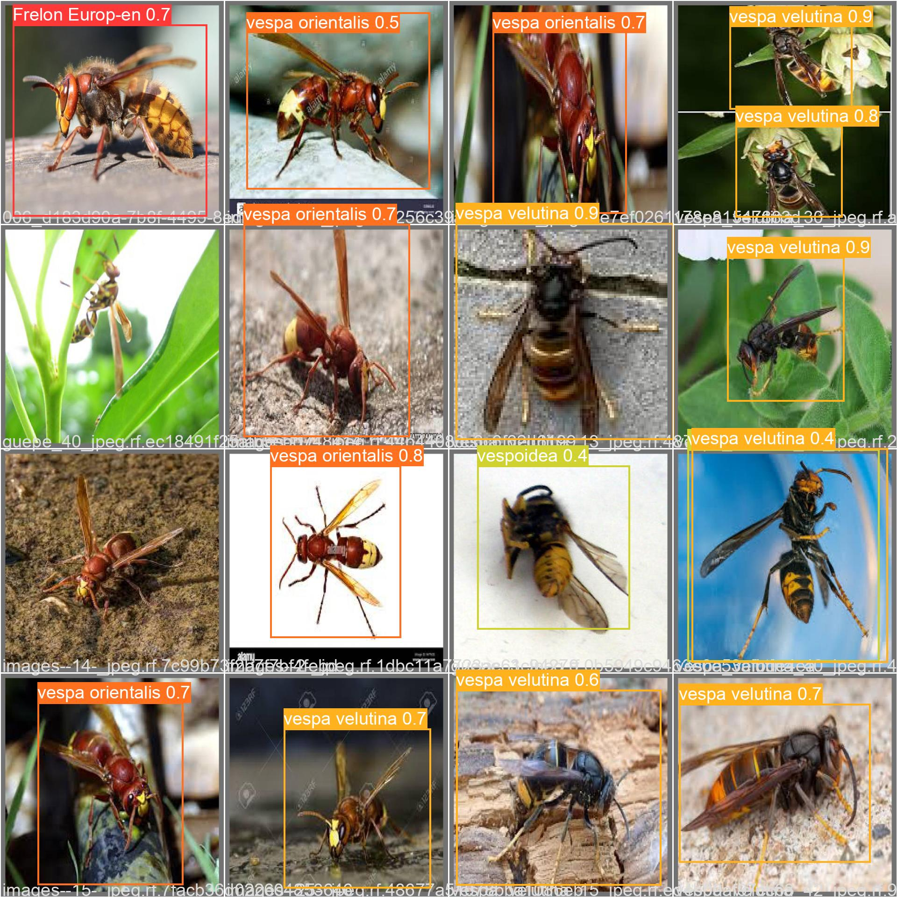
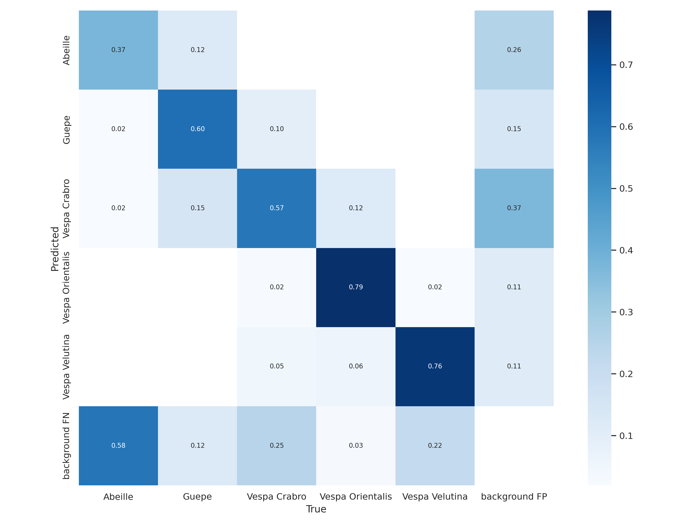
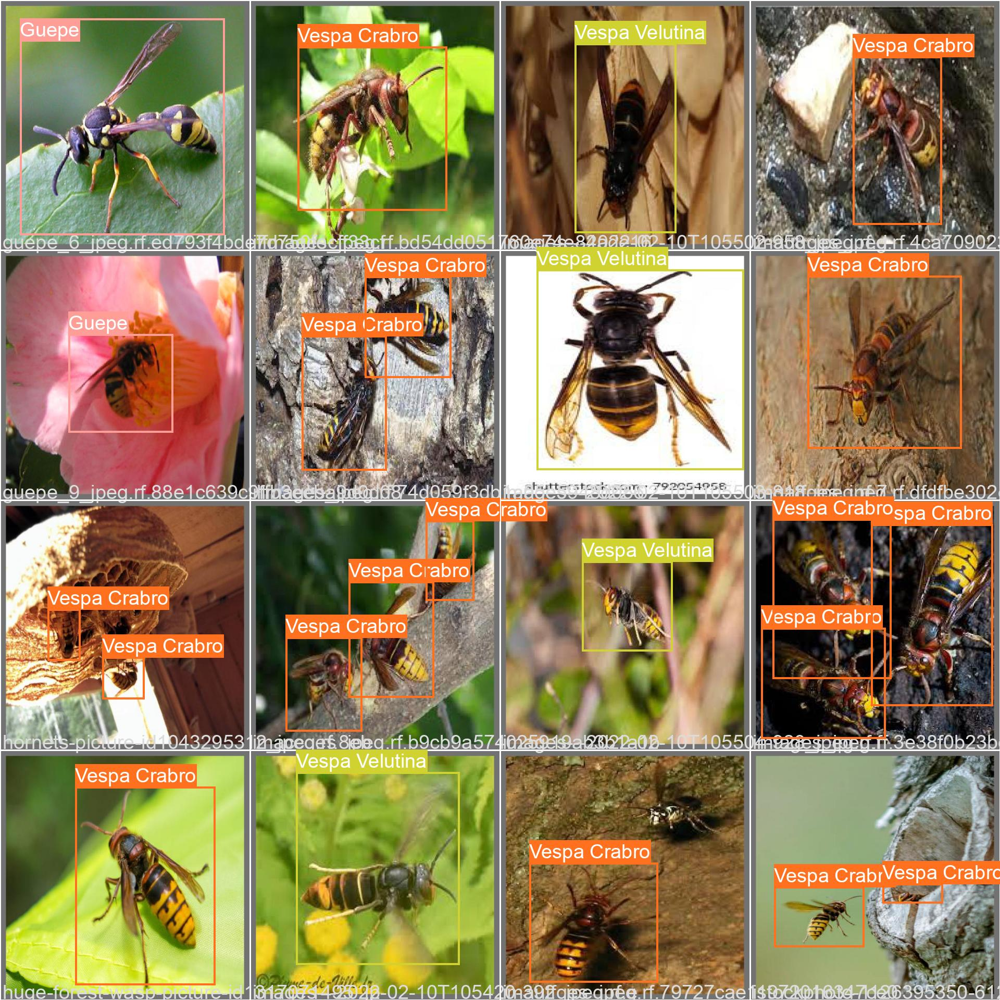
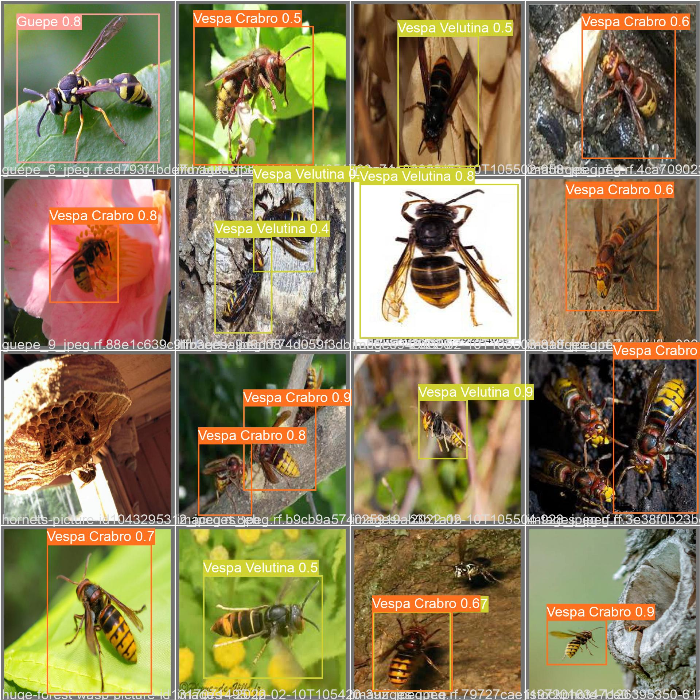

# Hymenoptera Recognizer
In this data set, we identify 5 differents classes :

(bees, wasps, european hornet, asian hornet, oriental hornet)

## Initialisation
```bash
git clone git@github.com:ultralytics/yolov5.git
cd yolov5
pip install -r requirements.txt
```

## Train the Yolo model
If you want to retrain the yolov5 model to add more classes, train on your own dataset, or for other reason, you can make your other version like this:
```bash
cd dataset
unzip Hymenoptera.v2i.yolov5pytorch.zip
cd ../yolov5
python train.py --img 640 --batch 16 --epochs 100 --data ../dataset/Hymenoptera.v2i.yolov5pytorch/data.yaml --weights yolov5m.pt
```
(You can add `--device cpu` to use CPU. Default is GPU.)

# Validate the Yolo model
You can see the train and validate results in `yolov5/runs/train/exp`.    
If the model looks good, you can run the following command before use it:
```bash
mv ./yolov5/runs/train/exp/weights/best.pt ./models/yolov5m.pt
```

# Use the Yolo model
For example, you can run our model on a simple image, like that:
```bash
./run.sh yolov5m_v2 ./src/image_1.jpg
```
The first argument is the model to use (`yolov5m_v1` or `yolov5m_v2`). The second argument is the path to the image to run. It's work also on video files. If you want to run the model on the webcam, you can give `0` as the second argument.          
The result is save on the `./src/results/` folder.

# Versions
In the `models` folder, you can find our 2 version of yolov5 trained.

## yolov5m_v1
Is trained with a dataset buildt using google image, label flow and roboflow. We have around 580 datas include all classes.     
There is the confusion matrix on validations data :

There is some exemple of waiting vs prredicted data :   
  



## yolov5m_v2
Is trained with a dataset buildt using google image, label flow and roboflow. We have around 2k datas include all classes.     
There is the confusion matrix on validations data :

There is some exemple of waiting vs prredicted data :   
  
