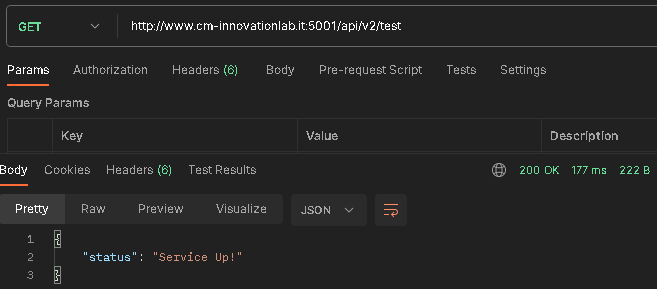
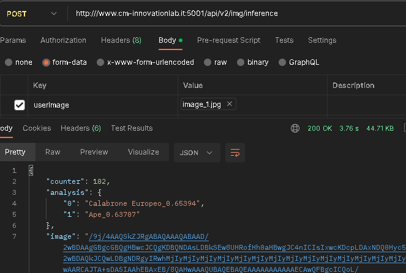

# AI Save Queen Bees Project
Starting from "Hymenoptera Recognizer" project, this fork add a possible client-server implementation to allow users to ask prediction for an image.<br/>
Final result is available at [AI Save Queen Bees - Web App](http://www.cm-innovationlab.it/aisavequeenbees.html).<br/>
You can find a rapid tutorial at [AI Save Queen Bees - Tutorial.mp4](https://www.cm-innovationlab.it/AISaveQueenBees%20-%20Tutorial.mp4).

## Server-side implementation with Python
In this example I use original [pre-trained model](/Hymenoptera-Recognizer/models/yolov5m_v2.pt).
Original documentation is available al link: [yolov5m_v2](../README.md#yolov5m_v2)

Configuration to run `endPoint.py` on Ubuntu server:

1. #### First of all read and install [yolov5 project](https://github.com/ultralytics/yolov5): follow [pypi.org_yolov5](https://pypi.org/project/yolov5/)
    ```bash
    pip install yolov5
    ```

2. #### Install [FLASK](https://flask.palletsprojects.com/en/2.2.x/)
    ```bash
    pip install Flask
    pip install -U flask-cors
    ```

3. #### Install SCREEN
    ```bash
    pip install screen
    ```

4. #### Now you can run the below code from the folder where you saved `endPoint.py` and Machine Learning Model:
    ```bash
    screen
    flask --app endPoint run --host=0.0.0.0 --port 5001
    ```

## Client-side implementation
In "client-side" folder you can find a possible usage of this web service.<br/>
After a rapid check on service status, user can:

* Select an image.
* Send image selected to server for Model Analysis.
* Read Model analysis results.
* Check on response image model result boxes.

## Service Methods
Below you can find methods available with relative endpoints.
1. #### GET to test service status:
    
1. #### POST to make inference:
    